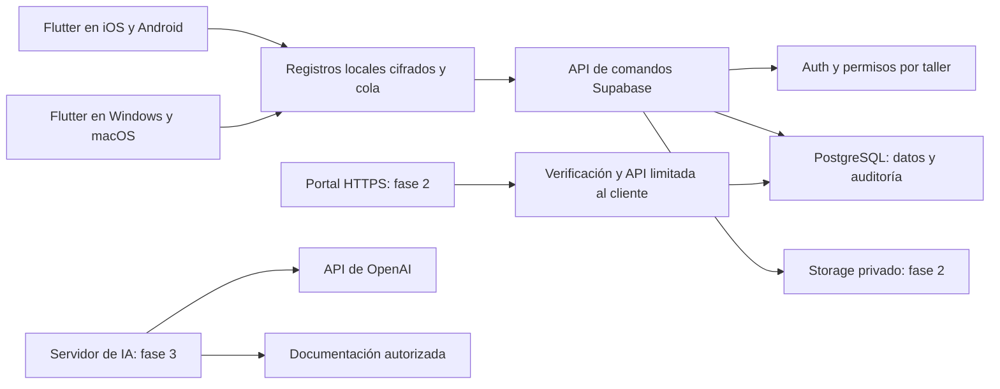

# Producto y arquitectura

## Decisiones iniciales

País: **España**, confirmado por el usuario. TallerFlow sustituye papel o programas antiguos; no depende de importar de un programa concreto. No se ha identificado documentación técnica contratada. No se habilitarán consultas a un proveedor sin confirmar acceso, correspondencia con el vehículo y licencia para integración/IA.

Una app común con vistas de operario, oficina y administrador. Operarios: móvil. Oficina: Windows nativo, con macOS para revisar durante el desarrollo. iOS y Android se desarrollan desde el Mac. El portal del cliente será un producto web sencillo de fase 2, alojado mediante HTTPS.

## Pantallas

| Pantalla | Función | Estado 0.1 |
|---|---|---|
| Acceso | Cuenta individual y taller | Cliente Supabase preparado; requiere configuración |
| Panel | Trabajo en curso, bloqueos y revisión | Demo funcional |
| Recepción | Vehículo, cliente, síntoma original, ubicación y llaves | Formulario funcional |
| Orden | Tareas, cronómetro, consumos, observaciones | Funcional con alcance descrito en README |
| Revisión | Cargos, autorizaciones, comprobaciones y nota | Funcional local; cierre nube bloqueado |
| Vehículos | Identidad estable e historial técnico | Vista inicial de órdenes descargadas |
| Catálogo | Referencias, unidades y stock | Lectura y consumos; administración pendiente |
| Configuración | Personas, tarifas, impuestos y políticas | Vista explicativa; edición desde servidor |
| Portal | Ver presupuesto, evidencias y autorizar partidas | Fase 2 |
| Diagnóstico | Cuaderno, fuentes y asistente | Fase 3 |

La app descarga solo órdenes accesibles y el catálogo. Una operación local identifica actor, dispositivo, orden y un UUID que no cambia al reintentar. En el servidor, los cambios operativos se añaden conservando registros; los cambios de oficina exigen la revisión correspondiente. Un conflicto se guarda para revisión. Los registros recibidos después de emitir un documento se conservan como incidencia.

## Datos y permisos

Datos en esquema `private`, sin permisos directos para clientes. Las funciones privilegiadas tienen `search_path` vacío, nombres cualificados y autorización explícita. Las funciones públicas son envoltorios sin privilegios propios. RLS está habilitado en todas las tablas privadas. No se debe exponer `private` en la Data API.

El taller se obtiene de la pertenencia del usuario, nunca de un dato confiable por estar enviado desde Flutter. Los operarios solo acceden a órdenes asignadas. No se incluyen claves OpenAI ni `service_role` en aplicaciones. La configuración pública de Supabase se proporciona al compilar.

El prototipo usa céntimos enteros, cantidades en milésimas de unidad e impuestos en puntos básicos. PostgreSQL usa `bigint` y conversiones explícitas. Cada línea redondea mitad hacia arriba; las bases e impuestos de líneas se suman. No se usa coma flotante en el cálculo monetario. La conversión a euros en pantalla no calcula documentos. La IA nunca modificará los importes.

Las autorizaciones de esta entrega son registros manuales por tarea. Los presupuestos completos versionados y el rechazo de partidas todavía requieren implementación en fase 2. El presupuesto antiguo deberá referirse a un ID de versión inmutable; un token antiguo nunca aprobará una nueva versión.

## Condiciones del cierre conectado

La API de emisión en nube devuelve un conflicto y la interfaz informa del bloqueo. No se habilitará hasta implementar este protocolo:

1. Registrar todos los dispositivos que descargan la orden.
2. Oficina solicita cierre sobre una revisión concreta.
3. Cada dispositivo envía su cola, detiene cronómetros y confirma esa solicitud, guardando un bloqueo local antes de confirmar.
4. Cualquier cambio invalida la solicitud. Un dispositivo desconectado sin confirmación impide el cierre.
5. El servidor valida tareas, autorizaciones, precios, calidad, stock y conflictos, y emite una instantánea inmutable dentro de una transacción.
6. Los registros tardíos se conservan; corregir un documento genera una nueva pieza trazable, sin sustituir el original.

No se utilizará un indicador de conexión ni una cola local vacía como prueba de que todos los móviles han enviado sus datos.

## Fases y criterios de salida

**Fase 1.** Completar las pendientes del README, conectar un entorno de pruebas Supabase, validar concurrencia/offline y realizar una jornada simulada en cada plataforma. Piloto de un taller con datos ficticios antes de datos reales.

**Fase 2.** Inspección configurable con fotos; recomendaciones pospuestas; presupuestos por versión; portal HTTPS con destinatario verificado, token temporal/revocable y acceso limitado a documentos del cliente; almacén/compras/devoluciones; garantías enlazadas; PDF; pagos parciales/completos. CSV con vista previa y duplicados, exportación y restauración completa. Un cambio de propietario no transferirá facturas ni datos personales anteriores.

**Fase 3.** Cuaderno de diagnóstico, casos validados y retirables, asistente técnico y oficina, dictado revisable, cámara para identificación y referencias. El asistente exige marca, modelo, año, motor y variante cuando corresponde; separa fuente, hipótesis, comprobación, medición y diagnóstico humano. DTC no equivale a pieza averiada. Diagramas se muestran como originales y se analizan visualmente. Toda respuesta técnica identifica fuentes y declara datos faltantes. No se implementarán pares, pines ni esquemas sin respaldo.

**Fase 4.** Agenda de operarios/elevadores, mantenimiento, flotas e integraciones de diagnosis, recambios, proveedores, facturación y pagos, tras confirmar contratos y compatibilidad.

## Servicios externos

| Servicio | Qué necesita | Cuándo |
|---|---|---|
| Supabase | Proyecto, usuarios y configuración pública; plan y copias adecuados | Entorno conectado de fase 1 |
| GitHub Actions | Repositorio del código y capacidad de ejecución | Compilación Windows desde navegador |
| Apple | Xcode; cuenta de desarrollador para distribución firmada | iOS físico/distribución |
| Android | Android Studio y SDK; firma propia para distribución | Android físico/distribución |
| Windows remoto | Equipo/servicio accesible desde Mac | Prueba manual de instalación y uso |
| Alojamiento HTTPS y correo/OTP | Dominio, verificación, secretos en servidor | Portal de fase 2 |
| Documentación técnica | Proveedor autorizado y licencia que admita IA | Fase 3 |
| OpenAI | Clave de servidor, modelos permitidos y límites por taller | Fase 3 |
| Facturación/recambios/pagos | Necesidad, APIs y acuerdos confirmados | Fase 4 |

## Facturación española

Las notas actuales indican «no es una factura». No se presume conformidad fiscal. Antes de desarrollar el módulo definitivo se concretarán sujeto fiscal, régimen, territorio, SII u otras circunstancias, numeración, correcciones y requisitos SIF/VERI*FACTU y factura electrónica aplicables.

La AEAT publicó la ampliación de los plazos generales de adaptación SIF: antes del 1 de enero de 2027 para entidades que presentan Impuesto sobre Sociedades y antes del 1 de julio de 2027 para el resto de obligados. Esta fecha por sí sola no determina las obligaciones del taller. Fuente consultada el 6 de octubre de 2026: [Agencia Tributaria](https://sede.agenciatributaria.gob.es/Sede/todas-noticias/2025/diciembre/3/ampliacion-plazo-adaptacion-sistemas-informaticos-facturacion.html).

La integración futura OpenAI conservará las claves únicamente en el servidor, conforme a la [documentación oficial de autenticación](https://developers.openai.com/api/reference/overview). Solo enviará datos necesarios; tendrá límites de consumo, modelo configurable, revisión humana y estará desactivada por defecto. No hay llamadas OpenAI ni gastos de IA en esta entrega.
